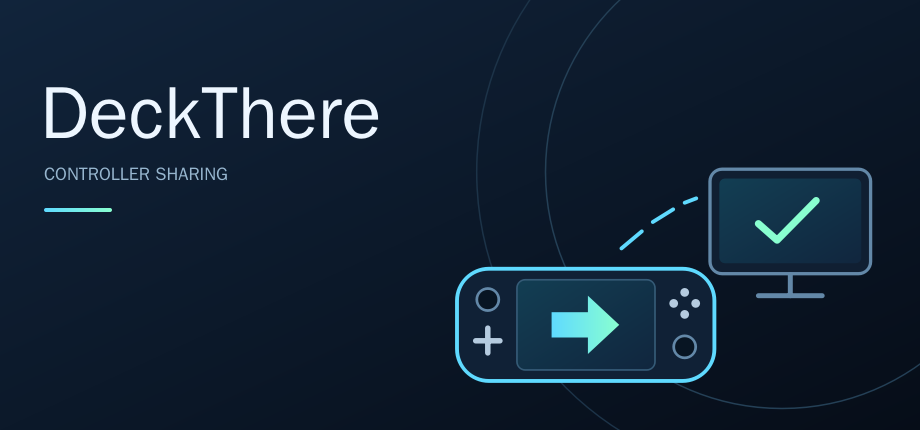

# DeckThere

Use your Steam Deck as a controller for another computer. DeckThere shares USB
input through [VirtualHere](https://www.virtualhere.com/), provides a status
dashboard and optional touch keyboard, and can dim the screen while sharing.
This is **not video streaming**: the game runs on the receiving computer.

DeckThere is an independent project, not affiliated with or endorsed by Valve or
VirtualHere.

- [Install on the Deck](#install-on-the-deck)
- [Connect the gaming PC](#connect-the-gaming-pc)
- [Interfaces and controls](#interfaces-and-controls)
- [Update or uninstall](#update-or-uninstall)
- [Troubleshooting](#troubleshooting)
- [Technical reference](docs/reference.md) · [Keyboard layouts](docs/keyboard-layouts.md) · [Development](docs/development.md)

## VirtualHere licensing

VirtualHere is proprietary software, separate from this MIT-licensed project.
DeckThere installs its **server** on the Deck; you install its **client** on the
receiving computer.

**A paid VirtualHere server license is strongly recommended, including for
controller-only use.** It supports the software that provides USB sharing.
Purchase and licensing are handled by [VirtualHere](https://www.virtualhere.com/).

The unlicensed one-device allowance supports controller-only use with either
dashboard. **Sharing the controller and touch keyboard simultaneously requires
a license:** they are two separate USB devices, not a combined device.

## Install on the Deck

Use Desktop Mode and run setup as your normal user, **not with sudo**. Log into
Steam at least once. If you have not set a sudo password, run `passwd` first.

```bash
cd ~
git clone https://github.com/kenjorissen/DeckThere.git deckthere
cd deckthere
./setup.sh
```

1. **Accept the Steam shortcut offer.** Save games and finish downloads before
   allowing setup to close Steam. Reopen it when prompted.
2. If you have a saved VirtualHere config/license,
   [import it before launching](#virtualhere-config-and-license).
3. Open **Library > Non-Steam > DeckThere > Play**. A new shortcut may not appear
   on Home / Recently Played until its first launch.
4. Follow the [PC connection steps](#connect-the-gaming-pc) below.

Fresh installs use the **GUI without a virtual USB keyboard**, with **auto-dim
on** and **automatic sleep off (Never)**. Setup preserves saved choices unless
you explicitly select another. See [Settings](#settings) to change them.

GUI setup installs a private Qt/PySide6 **6.11.2** runtime when needed (about
76 MiB compressed). It requires x86-64 Linux, Python 3.10+, and compatible glibc.
Terminal-only setup skips Qt. No system packages, system Python changes, Decky,
or SteamOS read-only changes are needed. The virtual keyboard uses stock
`dummy_hcd`, `libcomposite`, and `usb_f_hid` modules; GUI volume controls use uinput.

Setup verifies the live official VirtualHere checksum and reuses a matching
installed server, or downloads a verified copy. For offline installation, see
[manual downloads](docs/reference.md#downloads-and-verification).
Setup does not start DeckThere or enable it at boot. Installed operation does
not depend on keeping the checkout.

## Connect the gaming PC

1. Download the [VirtualHere USB Client](https://www.virtualhere.com/usb_client_software).
   On Windows, choose x86_64 for an Intel/AMD PC or ARM64 for an ARM-based PC.
   Follow permission/driver prompts; installing the client as a service is optional.
   Linux and macOS clients are also available.
2. Connect the Deck and PC to the same trusted network, and launch DeckThere.
3. In the client, right-click **Steam Controller** (it may include **Valve
   Software** in the label) and select **Use**. **Keep the touchscreen local**
   for the Deck's controls and exit gesture.
4. If the virtual keyboard is running, select **Use** on **DeckThere Touch
   Keyboard** as well. See [licensing](#virtualhere-licensing) for simultaneous sharing.
5. Configure Steam Input on the PC as needed, then play. Disconnecting a device
   in the client does not exit DeckThere on the Deck.

## Interfaces and controls

One **DeckThere** Steam shortcut reads the saved choice at each launch. To select
that choice during setup:

```bash
./setup.sh                   # keep saved choice; fresh default: GUI without keyboard
./setup.sh --gui             # GUI without virtual USB keyboard
./setup.sh --gui --keyboard  # GUI with virtual USB keyboard
./setup.sh --terminal        # terminal dashboard; no Qt download
```

`--keyboard` alone also selects GUI with keyboard. It cannot be combined with
`--terminal`. Only one sharing session can run at a time.

Both dashboards show time, battery, local IP, and TCP clients. **Server running**
means the service is active; a TCP connection does **not** prove the controller
is in use. Missing data is shown as unavailable. Redact addresses when sharing
screenshots. See [dashboard reporting](docs/reference.md#dashboard-reporting)
for sampling details.

### Settings

Open **SETTINGS** in the GUI, or tap the terminal's top-center **SETTINGS** control
or press local **S**. The panel distinguishes session controls from saved defaults:

| Control | Applies to | Saved for future launches? |
| --- | --- | --- |
| **Next launch: GUI / GUI + keyboard / Terminal** | Next launch | Yes |
| **Auto-dim now: On / Off** | Current GUI session | No |
| **Auto-dim on launch: On / Off** | Next launch, either interface | Yes |
| **Sleep after inactivity: Never / 5 / 15 / 30 / 60 minutes** | Current and future sessions | Yes |
| **Start/Stop keyboard for this session ONLY** | Current GUI session | No |

The next-launch controls do not change the current session. To change keyboard
or auto-dim behavior both now and on future launches, use the corresponding
session control and saved default. Live keyboard and auto-dim controls are
unavailable in terminal mode; the saved choices and sleep setting remain usable.

Settings requires private Qt. Without it, the terminal shows **Settings unavailable
— rerun setup with --gui**. Selecting terminal mode during setup retains any
installed Qt runtime. The panel never runs setup, downloads packages, prompts for
sudo, or changes Steam shortcuts; sharing continues while it is open.

### GUI and touch keyboard

The GUI opens on the dashboard. With the keyboard visible, a compact clock and
battery remain beside the keyboard button; charging state is included when space
permits. A small client label beside Settings shows TCP connection status without
an IP address. Volume Up/Down provide [brightness controls](#screen-brightness)
with or without the virtual keyboard.

With no keyboard running, the top-center notice reads **KEYBOARD NOT RUNNING**.
GUI-only startup does not create/export a virtual USB keyboard or load its USB
gadget modules. Once enabled, the **KEYBOARD / HIDE KEYBOARD** button changes
visibility only. **Stop keyboard** in Settings disconnects that device while
leaving controller sharing and brightness controls running.

Keys light up while touched, including multiple simultaneous touches and sliding
between keys. Modifier and Caps Lock highlights also reflect their latched state.
**RELEASE KEYS**, hiding the keyboard, opening a modal panel, or losing focus
clears held/latched input; clearing does not toggle the PC's Caps Lock.

Use **Layout: …** to choose the profile matching the PC. This changes Deck legends,
**not the PC's layout or IME**. See [keyboard layouts](docs/keyboard-layouts.md) for
modifier behavior, supported profiles, and input limitations.

### Terminal dashboard

Terminal mode uses a separate fullscreen Konsole with its own configuration;
normal Konsole windows are unaffected. Its layout adapts to the window size. Like
the GUI, battery colors turn amber at 30% and red at 15%. Terminal mode does not
intercept the volume buttons.

### Screen brightness

**Auto-dim on** captures the current brightness, applies the saved dim level, and
maintains the selected level against external changes. Turning it off or exiting
stops enforcement and restores the captured brightness once, even if it was dark.
With auto-dim off, there is no startup brightness write or exit restoration.

In the GUI, **Volume Up/Down** adjust brightness by one step and repeat while held,
with or without auto-dim. With auto-dim off, they start from the current physical
level. Manual adjustments are saved on release and clean shutdown as the dim level
for the next time auto-dim is enabled; externally observed changes are not saved.

Use [Settings](#settings) for the independent session and launch toggles, or choose
the saved launch default during setup:

```bash
./setup.sh --disable-auto-dim
./setup.sh --enable-auto-dim
```

Plain setup preserves the choice. The dim level defaults to **1%** on a nonlinear
scale. To edit it manually:

```bash
sudoedit /home/.deckthere/data/brightness-percent
```

Enter one whole number from **0 to 100**, without `%`, then restart DeckThere or
toggle auto-dim off and on. Missing or invalid values fall back to 1%; setup
preserves the file.

**Adaptive brightness may override** appears quietly beside the GUI brightness
indicator when Steam's saved setting is enabled or uncertain. Adaptive brightness
can override manual changes or compete with auto-dim, causing flicker. DeckThere changes the physical backlight, **not
Steam's slider or adaptive target**, and never changes Steam's adaptive setting.

**Zero can turn the screen dark on the generic brightness curve.** The calibrated
OLED curve instead uses a measured minimum. See
[brightness calibration and limitations](docs/reference.md#brightness-calibration).

### Automatic sleep

Choose **Sleep after inactivity** in Settings to sleep after **5, 15, 30, or 60
minutes**, or **Never** to stay awake. Controller buttons, sticks, analog triggers,
trackpad/stick touch, local screen/keyboard input and volume controls count as
activity. Held controls keep it awake; analog axes use small deadzones.
**Gyro-only movement does not count.**

After the chosen interval, a **30-second warning** appears. Touch it or use a
control to cancel and restart the idle interval. DeckThere then stops sharing and
performs [normal cleanup](#stop-sharing) before requesting system sleep.
**Waking does not restart sharing**; launch DeckThere again.

Missing/disconnected input sources, unsupported reports, lost events or an
unavailable warning display prevent automatic sleep. Settings shows the monitoring
status. This feature does not change Steam power settings or override other sleep
inhibitors. It uses SteamOS's stock `usbmon` module, not an extra package or a PC
helper. See [activity monitoring](docs/reference.md#optional-automatic-sleep).

### Gaming Mode idle handling

DeckThere uses a system sleep/idle inhibitor plus a Gamescope activity pulse every
ten seconds to prevent automatic dimming and sleep without changing saved Steam
power settings. This protection remains active even with auto-dim off or a
DeckThere sleep timeout selected. Pulses start before sharing and end during
cleanup. Desktop Mode skips the Gamescope workaround.

This uses an **undocumented activity counter**, not a supported inhibitor API.
Missing tools/counter, an ambiguous session, or a lost compositor cause startup
to fail or the active session to stop rather than silently continue unprotected.
Future Steam behavior may differ. See [idle protection](docs/reference.md#idle-protection)
for details and the troubleshooting opt-out.

**Exit DeckThere before deliberately putting the Deck to sleep.** Steam can leave
a black screen when its sleep transition is rejected by a system inhibitor
([upstream report](https://github.com/ValveSoftware/SteamOS/issues/2619)). Automatic
idle protection does not fix explicit power-button sleep.

### Stop sharing

- **GUI:** hold **HOLD 2s TO QUIT**. Releasing early, sliding off, or losing focus
  cancels it. GUI mode does not use the corner gesture.
- **Terminal:** hold one finger in any corner for two seconds, within the outer
  12% of both screen axes. Moving out or adding another finger cancels it. Lift
  all fingers before retrying, including a finger already down at startup.
  A local keyboard can also use **Ctrl+C**.
- **Fallback:** use **Steam > Exit Game**, or run the command below from Konsole
  or SSH. The Deck's Steam button may be forwarded to the PC.

```bash
sudo -n /home/.deckthere/bin/deckthere-root stop
```

Normal exit stops sharing, restores brightness only if auto-dim is on, and releases
idle/sleep protection. Power loss or forcibly killing the privileged service can
prevent restoration. A mostly static display can remain visible throughout a
session; consider OLED burn-in risk.

## VirtualHere config and license

The server creates **`/home/.deckthere/data/config.ini`** on its first run. This is
a root-private directory directly under `/home`, **not `~/.deckthere`** or the
checkout. To import a saved config, run setup first, then:

```bash
sudo -n /home/.deckthere/bin/deckthere-root stop
sudo install -o root -g root -m 600 /path/to/your/config.ini /home/.deckthere/data/config.ini
```

Replace the source path with your backup. This replaces the installed config
without changing the source. Keep backups private: the file can contain license
and connection credentials. DeckThere does not automatically back it up.

## Update or uninstall

To update from your checkout:

```bash
git switch main
git pull --ff-only
./setup.sh
```

Setup stops the current session and updates installed files. It preserves the
config/license and all saved preferences. Accept the shortcut update to refresh
Steam integration while retaining the app ID and custom artwork.

If a SteamOS update removes the service or sudo rule, the installed launcher
checks before sharing starts and offers **Repair / Cancel** only when needed.
Repair uses the system's graphical administrator-password dialog; DeckThere never
collects or stores the password. It restores only its system integration, retaining
all saved options and the license, without downloads or shortcut changes.

If graphical authentication is unavailable in Gaming Mode, switch to Desktop Mode
and launch DeckThere there. Missing/damaged trusted repair files require running
setup again. Cancellation or failed verification does not start sharing. See
[launch repair](docs/reference.md#launch-repair) for limits.

To uninstall, run as your normal user:

```bash
~/.local/share/deckthere/uninstall.sh
# Or, from the checkout: ./uninstall.sh
```

Normal uninstall removes installed programs, private Qt, service, and sudo rule.
It **keeps** `/home/.deckthere/data`, saved startup/auto-dim/sleep preferences, and
Steam's artwork copies. Remove the non-Steam shortcut manually. The checkout is
untouched.

**To also permanently delete the settings and license:**

```bash
~/.local/share/deckthere/uninstall.sh --purge-settings
```

## Troubleshooting

### Diagnostics and manual launch

```bash
~/.local/share/deckthere/doctor.sh
systemctl status deckthere.service
```

Diagnostics report installed paths, permissions, runtime availability, installed
commit, binary hashes, service state, and recent logs without changing settings.
An inactive service is normal when not sharing. **Review output before posting
it:** VirtualHere journal messages can contain licensing information, and network
addresses may be visible. Do not share private config or typed content.

For additional logs, use `sudo journalctl -u deckthere.service -n 100 --no-pager`.
To run the installed app directly from the Deck's Konsole:

```bash
~/.local/share/deckthere/deckthere-launch.sh --terminal
# Or: --gui, or --gui --keyboard (requires installed private Qt)
```

These launch the real sharing service and apply the saved auto-dim choice.
Explicit interface flags apply to that launch; they do not save a new default.

### Connection troubleshooting

Check that DeckThere is running and the Deck and PC can reach each other. Avoid
guest networks with client isolation; check firewall rules for TCP **7575**, the
default VirtualHere port. The client can also use a manually specified server
address. **Do not expose the server to the public internet.** DeckThere does not
configure firewall rules or server authentication.

### Steam shortcut and artwork

Installation can succeed even if shortcut setup is skipped. To add/update the
shortcut from the installed files:

```bash
python3 ~/.local/share/deckthere/steam-shortcut.py
# Read-only account/path check:
python3 ~/.local/share/deckthere/steam-shortcut.py --check
# If multiple accounts are listed:
python3 ~/.local/share/deckthere/steam-shortcut.py --account 12345678
```

The helper backs up `shortcuts.vdf`, preserves unrelated shortcuts, and asks before
closing Steam. It never force-kills Steam; noninteractive use does not close or
open it automatically. See [manual shortcut fields](docs/reference.md#manual-steam-shortcut)
if needed.

Setup includes an icon, portrait/landscape tiles, hero background, and logo. Accept
the shortcut update and restart Steam to use them. Only missing artwork and empty
icon fields are filled; existing custom images stay untouched.



## Further documentation

- [Technical reference](docs/reference.md): downloads, installed paths, privilege
  boundaries, lifecycle, brightness calibration, and manual shortcut settings.
- [Keyboard layouts](docs/keyboard-layouts.md): supported profiles, host behavior,
  limitations, and reporting input problems.
- [Development](docs/development.md): source layout, checks, and asset generation.

## Credits and license

Thanks to [Deckpad by HelloThisIsFlo](https://github.com/HelloThisIsFlo/Deckpad)
and its contributors for the network-controller workflow and ideas for Steam/
Konsole launching, dimming, sleep handling, and touchscreen exit. No endorsement
by Deckpad's authors is implied.

Code, documentation, and bundled artwork are MIT licensed; see [LICENSE](LICENSE).
VirtualHere and the private Qt runtime have their own licenses. This project's
license does not grant rights to third-party code or assets.
